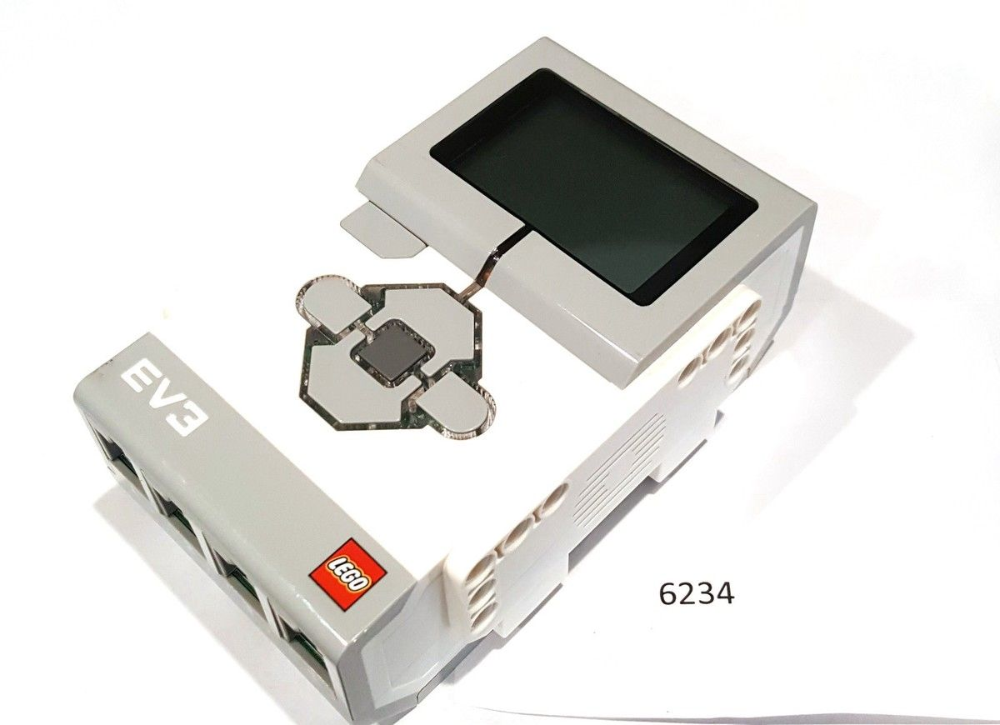
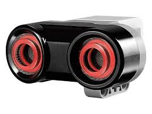

# WRO Future Engineers 2025

  <h1>What.</h1>

### 1. Mobility Management
The front two wheels of the car are controlled by 1 medium EV3 motor, which the front two wheels control the steering. The back wheels are also controlled by a EV3 medium motor but with a differential gear, which allows the other wheel to move even if one is stuck. Although EV3 medium motors are less powerful than the large motors, it is faster and has better control over the car, allowing our car to be more precise when turning and moving in straight lines. 

### Motor

<table>
  <tr>
    <td width="50%" align="center">
      
    </td>
    <td width="50%" align="left" valign="top">
      <h1>Specifications</h1>
      <ul>
        <li>Voltage: 9V</li>
        <li>Speed: 250RPM Max</li>
        <li>Torque: 8N/Cm</li>
        <li>Weight: 41g</li>
      </ul>
    </td>
  </tr>
</table>

The positives of differential gears include improved handling when turning. It allows the wheels to move at different speeds, allowing the turning of a corner to be more accurate and fast, also giving us a smooth turning. 
Steering Feature 
The steering feature in the front allows us to 

### 2. Power and Sense Management

This robot’s power and sense management system is composed of the Ev3 intelligence brick, ultrasonic sensors, a color sensor, a gyro sensor and a pixy cam(possibly). 

Our car has two ultrasonic sensors on the left and right to sense for walls and when to make a turn. It is is on the siwde and not on the front because then the car will not turn as well if there is only one at the front. There is also a color sensor on the front facing the bottom to 

### EV3 Intelligence Brick

<table>
  <tr>
    <td width="50%" align="center">
      
    </td>
    <td width="50%" align="left" valign="top">
      <h1>Specifications</h1>
      <ul>
        <li>Processor: 300 MHz ARM9</li>
        <li>Memory: 64MB</li>
        <li>Storage: 16MB Flash Memory</li>
        <li>Voltage: 9V</li>
        <li>Weight: 215g</li>
        <li>Size: 11.5 x 7.5 x 4.7 cm (L x W x H)</li>
      </ul>
    </td>
  </tr>
</table>

Our car is powered by an Ev3 intelligence brick, with a 9V voltage, capable of running all the motors and sensors used in our car for a long period of time. It holds the car together, and is on the inside of the car. Potential improvements could include putting the intelligence brick in a more accessible area, allowing us to replace battery, and start the program better. 

### Ultrasonic Sensors
Our car has two ultrasonic sensors to detect the surrounding walls and when it is near a corner to turn left or right. 

<table>
  <tr>
    <td width="50%" align="center">
      
    </td>
    <td width="50%" align="left" valign="top">
      <h1>Specifications</h1>
      <ul>
        <li>Range: 1 - 250cm</li>
        <li>Frequency: 40kHz</li>
      </ul>
    </td>
  </tr>
</table>

