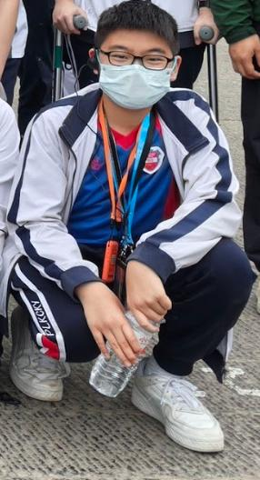
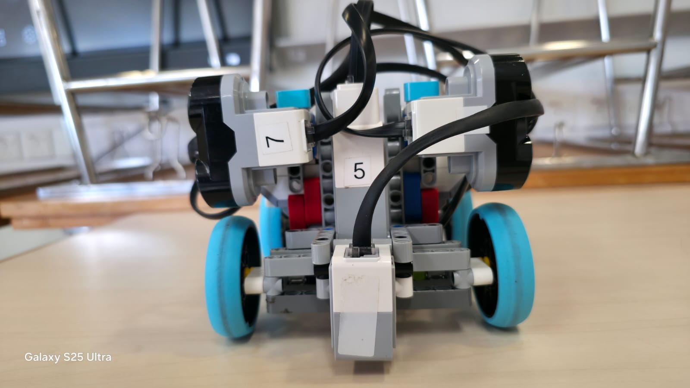
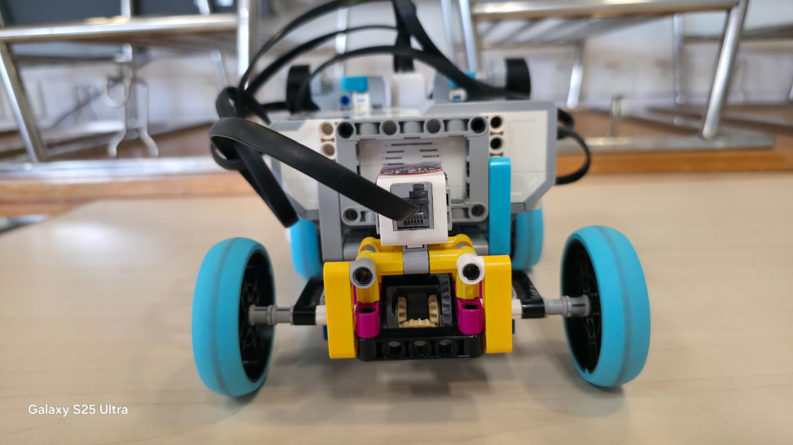
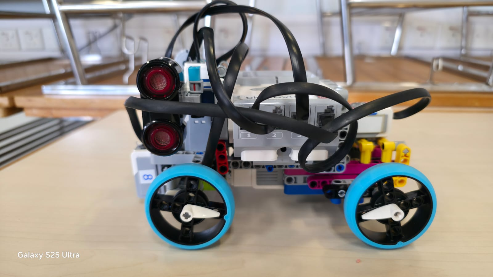
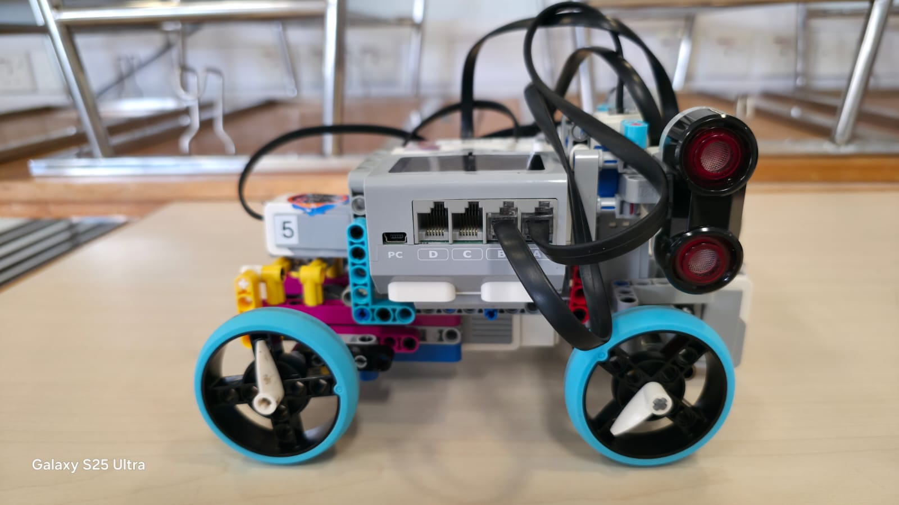
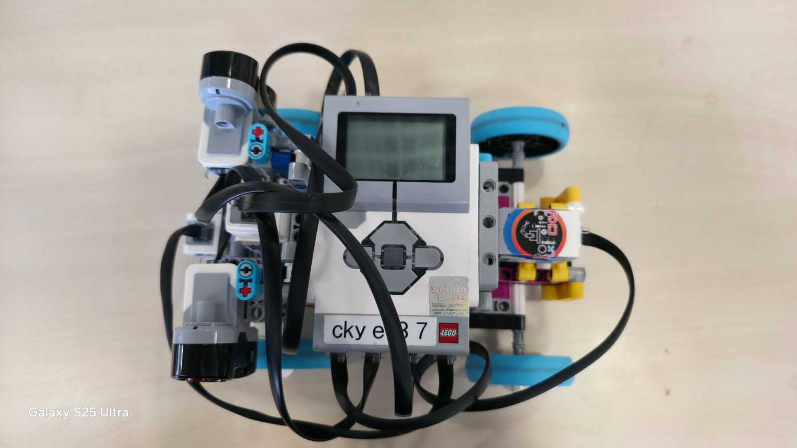
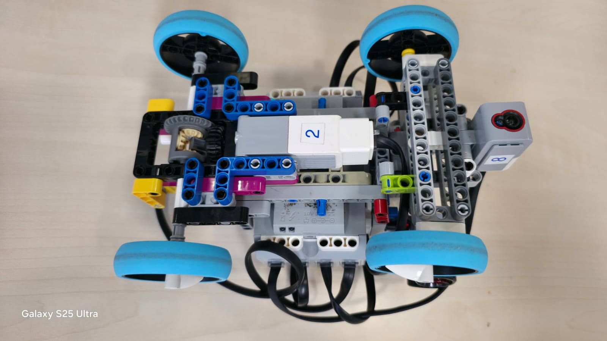

# WRO Future Engineers 2025

  <h1>What.</h1>

  

# The Team

### Jack Wong

  

Hi! I’m Jack, and this is my second year joining WRO. Last year I joined RoboMission Junior and won the Hong Kong round in team Control C. This year, I gave myself a new challenge to join Future Engineer, an event that I had no past experience in. Being the team leader and the main coder of the team, I have learnt much and hope to have satisfactory results!

### Moses Wong

  

Hello. I’m Moses, and this is my first year participating in WRO. This year, I have dedicated myself into Future Engineer, an event which I am completely new to. I have strong interests in technology, computers and programming, and I hope to achieve good results this time.

### Ethan Mak

  

Hi! My name is Ethan. My academic passions is science, ict and robotics, but I enjoy cooking, playing in orchestra and basketball.

# 1. Mobility Management
The front two wheels of the robot allow the car to steer accordingly, this is controlled via a Medium EV3 motor. The back wheels are responsible for propelling the car forward, this is also controlled by a EV3 medium motor paired with a differential gearbox, allowing both wheels to spin independently despite having to withstand different friction forces, this inturn allows our car to steer more sharply over the turns. Although EV3 medium motors are less powerful than the large motors, it is faster and has better control over the car, allowing our car to be more precise when turning and moving in straight lines. 

### Motor

<table>
  <tr>
    <td width="50%" align="center">
      
    </td>
    <td width="50%" align="left" valign="top">
      <h1>Specifications</h1>
      <ul>
        <li>Voltage: 9V</li>
        <li>Speed: 250RPM Max</li>
        <li>Torque: 8N/Cm</li>
        <li>Weight: 41g</li>
      </ul>
    </td>
  </tr>
</table>

The positives of differential gears include improved handling when turning. It allows the wheels to move at different speeds, allowing the turning of a corner to be more accurate and fast, also giving us a smooth turning. 

We utilized a Direct Current (DC) motor, specifically the JGA25-370 type, selected for its numerous advantages. This Medium Motor is engineered for applications that require both precision and moderate power, making it particularly well-suited for steering mechanisms or the movements of smaller robots. It operates at speeds of up to 240 revolutions per minute (RPM) and generates a torque of approximately 8 N·cm. This optimal combination of speed and torque makes it ideal for managing lightweight components and providing nuanced, directional control in a vehicle's steering system. Additionally, the motor is equipped with built-in encoders that offer feedback to the EV3 Brick, enabling precise control over rotations and positions—an essential capability for ensuring consistent vehicle movement and maneuverability.

This chassis offers a variety of advantages. First and foremost, the Ackermann steering geometry is engineered to ensure that all wheels of the vehicle trace circular paths during turns. This design minimizes tire scrub and enhances maneuverability. The geometry of the steering linkage promotes proper wheel alignment, which in turn improves stability and control. Additionally, the chassis design effectively distributes forces evenly, aiding in load management during turns and reducing wear on both the tires and steering components. Furthermore, the steering mechanism provides a mechanical advantage, making steering easier and requiring less effort. This feature is particularly important for remote-controlled and autonomous vehicles.

# 2. Power and Sense Management

### EV3 Intelligence Brick

<table>
  <tr>
    <td width="50%" align="center">
      
    </td>
    <td width="50%" align="left" valign="top">
      <h1>Specifications</h1>
      <ul>
        <li>Processor: 300 MHz ARM9</li>
        <li>Memory: 64MB</li>
        <li>Storage: 16MB Flash Memory</li>
        <li>Voltage: 9V</li>
        <li>Weight: 215g</li>
        <li>Size: 11.5 x 7.5 x 4.7 cm (L x W x H)</li>
      </ul>
    </td>
  </tr>
</table>

Our car is powered by an Ev3 Intelligent Brick, with a 9V voltage, capable of running all the motors and sensors used in our car for a long period of time. This brick not only provides the necessary power but also serves as a structural component, helping to hold the car together. 

In the Open Challenge, we implemented 2 Ultrasonic sensors to measure the distance between the car and surrounding walls. Initially, we set a target angle for the car to align with the center of the track, starting at 0 degrees and increasing by 90 degrees after each turn. However, we recognized that the EV3 gyro could experience drift, leading to inaccurate data. To address this issue, we relied on the ultrasonic sensor for distance measurements. When the car detects a wall close to its left or right side, it adjusts its moving angle to realign with the center of the track. 

### Ultrasonic Sensors
Additionally, during the obstacle challenge round, the ultrasonic sensor identifies nearby obstacles, allowing the car to assess the distance between itself and these objects. This information is crucial for enabling the car to make timely decisions to turn left or right in response to traffic signs, enhancing its navigational capabilities.

<table>
  <tr>
    <td width="50%" align="center">
      
    </td>
    <td width="50%" align="left" valign="top">
      <h1>Specifications</h1>
      <ul>
        <li>Range: 1 - 250cm</li>
        <li>Frequency: 40kHz</li>
      </ul>
    </td>
  </tr>
</table>

### Color Sensors

Our car is equipped with a color sensor, for detecting the yellow and blue lines on the map. This acts as a failsafe to the turning of the car. If the ultrasonic sensor is unable to detect the walls, or lack thereof, the colour sensor allows the robot to turn no matter the data which ultrasonic sensors return.

<table>
  <tr>
    <td width="50%" align="center">
      
    </td>
    <td width="50%" align="left" valign="top">
      <h1>Specifications</h1>
      <ul>
        <li>Weight: 17g</li>
      </ul>
    </td>
  </tr>
</table>

###Gyro Sensor

The gyro sensor is needed for turning and to ensure the car is driving in a straight line. The gyro acts as the first layer of control, which the robot mainly relies on during Open Challenge. We noticed several flaws in the heavy reliance of the gyro sensor, for example, a prominent issue is the cumulative error which builds up over 3 laps. Thus, our team used ultrasonic sensor to support the weaknesses in the Gyro Sensor. 

<table>
  <tr>
    <td width="50%" align="center">
      
    </td>
    <td width="50%" align="left" valign="top">
      <h1>Specifications</h1>
      <ul>
        <li>Accuracy: +/- 3 degrees</li>
        <li>Max output: 440°/sec/li>
        <li>Sample rate 1 kHz</li>
      </ul>
    </td>
  </tr>
</table>

### HuskeyLens

Because the Ev3 color sensor cannot detect color from far away, we used huskeylens to detect the red and green bricks. We used the colour detection mode on the Huskylens camera and identified Colour Red as ID1 and Colour Green as ID2.

<table>
  <tr>
    <td width="50%" align="center">
      
    </td>
    <td width="50%" align="left" valign="top">
      <h1>Specifications</h1>
      <ul>
        <li>Processor: Kendryte K210</li>
        <li>Image Sensor: OV2640 / GC0328</li>
        <li>Supply Voltage: 3.3~5.0V</li>
        <li>Current Consumption(TYP): 320mA @ 3.3V, 230mA @ 5.0V (face recognition mode; 80% backlight brightness; fill light off)</li>
        <li>Interrupt: UART; I2C</li>
        <li>Display: 2.0-inch IPS screen with 320*240 resolution</li>
        <li>Built-in Algorithms: Face Recognition, Object Tracking, Object Recognition, Line Tracking, Color Recognition, Tag Recognition, Object Classification</li>
        <li>Dimension: 52mm x 44.5mm (2.05*1.75 inch</li>
      </ul>
    </td>
  </tr>
</table>

# 3. Obstacle Management

For the obstacle challenge, we utilized the Huskylens to identify the green and red blocks that represent traffic signs. We implemented color recognition, designating the green block as ID1 and the red block as ID2. Using the Mindstorm software, we introduced a variable called "zone no." to categorize the image input from the Huskylens into three rows based on the heights of the blocks. The closest block was assigned "zone no. 1," the middle block received a value of 2, and the furthest block was designated "zone no. 3." The car's turning angle was adjusted according to its distance from the block, determined by the corresponding zone number.

Additionally, we created a variable named "zone letter," which divided the image from the Huskylens into three lateral zones: left, middle, and right. The left zone was assigned a value of 1, the middle zone a value of 2, and the right zone a value of 3. According to our rules, when the car detects a red traffic sign, it must turn right; thus, it will execute a sharper turn if the block is closer to its right side. Conversely, for the green block, the car will turn more sharply if the block is nearer to its left side. The maximum turning angle is set at 35 degrees, and the car will not turn if the block is already in the dodging zone, ensuring it avoids collisions.

To facilitate this, we transformed the image input from the Huskylens into a 3 x 3 grid and implemented a simple form of proportional turning based on PID control. This approach provides the car with increased flexibility in dodging obstacles. After executing a dodge, we adjusted the car to align parallel to the track, using a gyro for self-correction. However, the car also needs to monitor the blocks in the next row and move towards the midline to maintain consistent dodging behavior. As a result, it will turn 35 degrees in the opposite direction of its previous dodge.

We incorporated a loop interrupt in the program, allowing the turn to be interrupted if necessary to avoid the next block. This process continues until one of the ultrasonic sensors, mounted on the other side, detects a distance greater than 200 degrees, prompting the car to turn 90 degrees and resume the traffic light dodging program.

# 4. Pictures - Team and Vehicles

<table align="center">
  <tr>
    <td align="center"><strong>Front View</strong></td>
    <td align="center"><strong>Back View</strong></td>
  </tr>
  <tr>
    <td align="center">
      
    </td>
    <td align="center">
      
    </td>
  </tr>
  <tr>
    <td align="center"><strong>Left View</strong></td>
    <td align="center"><strong>Right View</strong></td>
  </tr>
  <tr>
    <td align="center">
      
    </td>
    <td align="center">
      
    </td>
  </tr>
  <tr>
    <td align="center"><strong>Top View</strong></td>
    <td align="center"><strong>Bottom View</strong></td>
  </tr>
  <tr>
    <td align="center">
      
    </td>
    <td align="center">
      
    </td>
  </tr>
</table>
